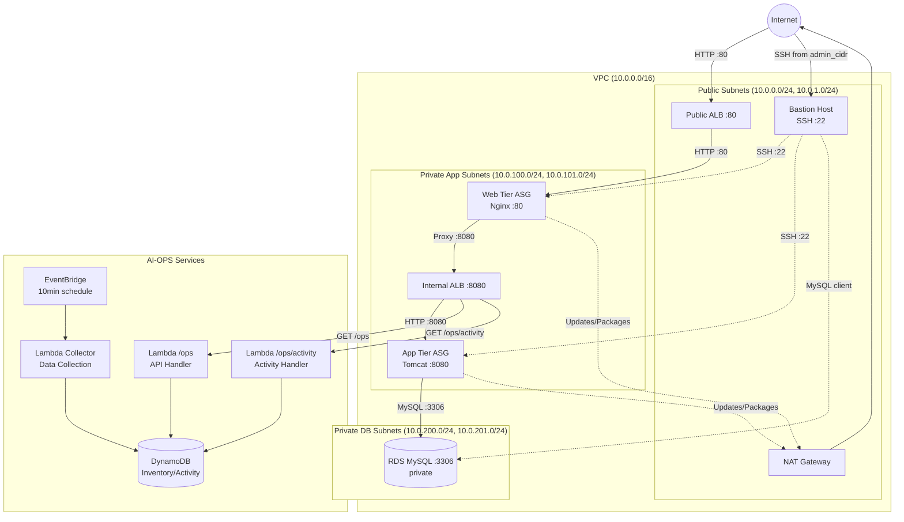

```mermaid
flowchart TD
  Internet((Internet))
  
  subgraph VPC["VPC (10.0.0.0/16)"]
    subgraph Public_Subnet["Public Subnets (10.0.0.0/24, 10.0.1.0/24)"]
      ALB_WEB[Public ALB :80]
      Bastion[Bastion Host\nSSH :22]
      NATGW[NAT Gateway]
    end
    
    subgraph Private_App["Private App Subnets (10.0.100.0/24, 10.0.101.0/24)"]
      WEB_ASG[Web Tier ASG\nNginx :80]
      ALB_APP[Internal ALB :8080]
      APP_ASG[App Tier ASG\nTomcat :8080]
    end
    
    subgraph Private_DB["Private DB Subnets (10.0.200.0/24, 10.0.201.0/24)"]
      RDS[(RDS MySQL :3306\nprivate)]
    end
  end
  
  subgraph AI_OPS["AI-OPS Services"]
    DDB[(DynamoDB\nInventory/Activity)]
    EB[EventBridge\n10min schedule]
    L_COL[Lambda Collector\nData Collection]
    L_OPS[Lambda /ops\nAPI Handler]
    L_ACT[Lambda /ops/activity\nActivity Handler]
  end

  %% External Traffic Flow
  Internet -->|HTTP :80| ALB_WEB
  ALB_WEB -->|HTTP :80| WEB_ASG
  WEB_ASG -->|Proxy :8080| ALB_APP
  ALB_APP -->|HTTP :8080| APP_ASG
  APP_ASG -->|MySQL :3306| RDS

  %% Outbound Internet Access
  WEB_ASG -.->|Updates/Packages| NATGW
  APP_ASG -.->|Updates/Packages| NATGW
  NATGW --> Internet

  %% Admin Access
  Internet -->|SSH from admin_cidr| Bastion
  Bastion -.->|SSH :22| WEB_ASG
  Bastion -.->|SSH :22| APP_ASG
  Bastion -.->|MySQL client| RDS

  %% AI-OPS Integration
  ALB_APP -->|GET /ops| L_OPS
  ALB_APP -->|GET /ops/activity| L_ACT
  L_OPS --> DDB
  L_ACT --> DDB
  EB --> L_COL --> DDB

```
