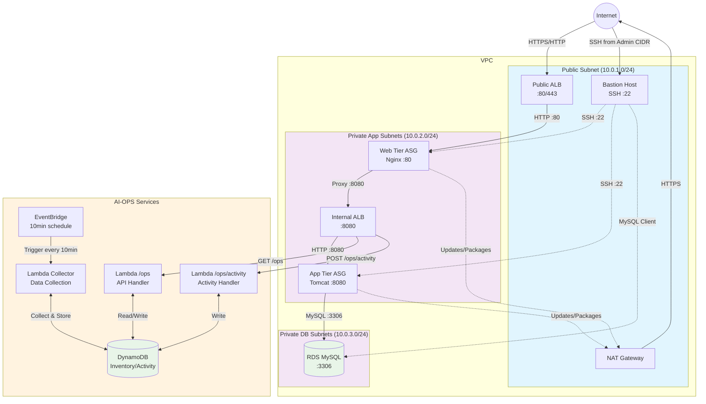

```mermaid
flowchart TD
  Internet((Internet))
  
  subgraph VPC["VPC"]
    subgraph Public_Subnet["Public Subnet (10.0.1.0/24)"]
      ALB_WEB[Public ALB<br/>:80/443]
      Bastion[Bastion Host<br/>SSH :22]
      NATGW[NAT Gateway]
    end
    
    subgraph Private_App["Private App Subnets (10.0.2.0/24)"]
      WEB_ASG[Web Tier ASG<br/>Nginx :80]
      ALB_APP[Internal ALB<br/>:8080]
      APP_ASG[App Tier ASG<br/>Tomcat :8080]
    end
    
    subgraph Private_DB["Private DB Subnets (10.0.3.0/24)"]
      RDS[(RDS MySQL<br/>:3306)]
    end
  end
  
  subgraph AI_OPS["AI-OPS Services"]
    DDB[(DynamoDB<br/>Inventory/Activity)]
    EB[EventBridge<br/>10min schedule]
    L_COL[Lambda Collector<br/>Data Collection]
    L_OPS[Lambda /ops<br/>API Handler]
    L_ACT[Lambda /ops/activity<br/>Activity Handler]
  end

  %% External Traffic Flow
  Internet -->|HTTPS/HTTP| ALB_WEB
  ALB_WEB -->|HTTP :80| WEB_ASG
  WEB_ASG -->|Proxy :8080| ALB_APP
  ALB_APP -->|HTTP :8080| APP_ASG
  APP_ASG -->|MySQL :3306| RDS

  %% Outbound Internet Access
  WEB_ASG -.->|Updates/Packages| NATGW
  APP_ASG -.->|Updates/Packages| NATGW
  NATGW -->|HTTPS| Internet

  %% Admin Access
  Internet -->|SSH from Admin CIDR| Bastion
  Bastion -.->|SSH :22| WEB_ASG
  Bastion -.->|SSH :22| APP_ASG
  Bastion -.->|MySQL Client| RDS

  %% AI-OPS Integration
  ALB_APP -->|GET /ops| L_OPS
  ALB_APP -->|POST /ops/activity| L_ACT
  L_OPS <-->|Read/Write| DDB
  L_ACT <-->|Write| DDB
  EB -->|Trigger every 10min| L_COL
  L_COL <-->|Collect & Store| DDB

  %% Styling
  classDef publicSubnet fill:#e1f5fe
  classDef privateSubnet fill:#f3e5f5
  classDef database fill:#e8f5e8
  classDef aiServices fill:#fff3e0
  
  class Public_Subnet publicSubnet
  class Private_App,Private_DB privateSubnet
  class RDS,DDB database
  class AI_OPS aiServices
```
